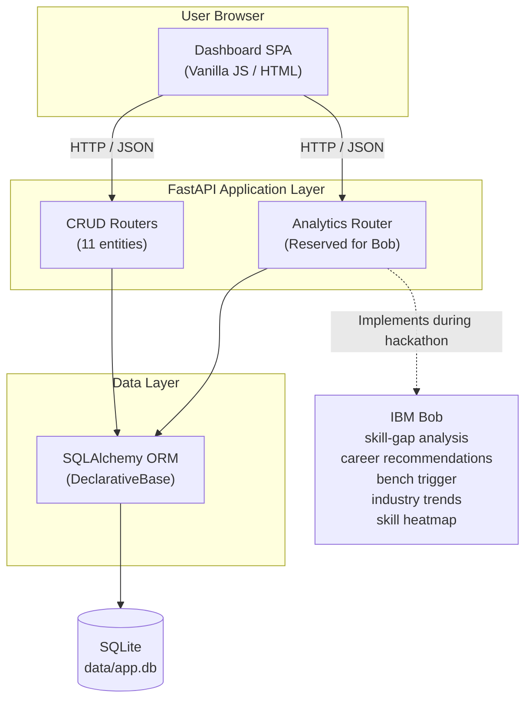
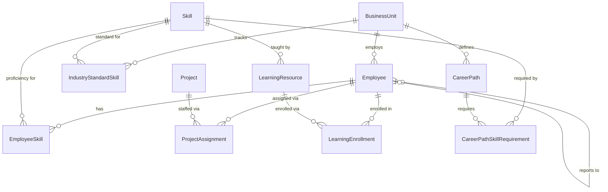

> **Reference checklist — not the public README.**
> This file is a longer-form personal checklist preserved during the
> hackathon. The public-facing README is `README.md`.

---

# CareerPath AI

_Enterprise Talent & Skill Intelligence Platform_

---

## Hackathon banner

| Field | Detail |
|---|---|
| Submitted to | IBM Bob Dev Day Hackathon 2026 |
| Theme | Turn idea into impact faster |
| Build pattern | Pre-hackathon baseline scaffold + IBM Bob intelligent analytics layer |
| Positioning | A unified internal platform that maps workforce skills, career paths, and learning investments — then uses IBM Bob to turn that data into actionable intelligence in real time. |

---

## Table of contents

- [Problem statement](#problem-statement)
- [Solution overview](#solution-overview)
- [Key features](#key-features)
- [Architecture](#architecture)
- [Data model](#data-model)
- [API reference](#api-reference)
- [Folder structure](#folder-structure)
- [Getting started](#getting-started)
- [Hackathon context — before Bob (current state)](#hackathon-context--before-bob-current-state)
- [Hackathon context — after Bob (planned state)](#hackathon-context--after-bob-planned-state)
- [Hackathon submission deliverables checklist](#hackathon-submission-deliverables-checklist)
- [Theme alignment](#theme-alignment)
- [Project status notes](#project-status-notes)
- [License](#license)
- [Acknowledgements](#acknowledgements)

---

## Problem statement

Large enterprises carry thousands of employees across dozens of business units, yet most lack a single coherent view of who can do what, who is idle, and where the skill gaps are. Managers rely on spreadsheets and tribal knowledge to staff projects. HR teams run periodic skill surveys that are obsolete within a quarter. Career development conversations happen once a year, if at all. The result is a workforce that is simultaneously over-staffed in some areas and skill-deficient in others, with no systematic mechanism to detect or correct the imbalance.

The cost is measurable. Bench employees sitting idle for weeks consume salary and overhead without generating revenue. Attrition rises when employees see no structured path to the next role and no investment in their growth. Project delivery slips when the right skill profile is not available at the right time. Perhaps most damagingly, workforce skills lag industry-standard demand in fast-moving domains — GenAI engineering, MLOps, cloud-native architectures — because no one is systematically tracking what the market needs versus what the team currently has.

The opportunity is a single internal platform that maintains a live, normalized record of every employee, their current skill proficiencies, their project history, their line-manager chain, and the skills their business unit is expected to need next. With that data in one place, it becomes possible to compute real career paths, surface personalized learning plans, auto-enrol bench employees in targeted courses, and show leadership exactly where the skill heatmap is red before the next staffing crunch arrives.

IBM Bob makes this buildable in a hackathon window, not a quarterly roadmap. A structured API built by the development team provides all the domain data. IBM Bob adds the analytical reasoning layer on top of it — producing the algorithms, the recommendation logic, and the aggregation endpoints that turn records into decisions.

---

## Solution overview

CareerPath AI is a FastAPI application backed by a SQLite database, served alongside a self-contained vanilla JavaScript dashboard. The backend exposes a normalized relational model with eleven entities covering the full talent-development domain: business units, employees with self-referential manager hierarchies, projects and project assignments, skills categorized as technical, domain, soft, and emerging, per-employee skill proficiency records, industry-standard skill importance and trend data per business unit, career paths with required-skill thresholds, learning resources, and learning enrollments.

Every entity has a complete CRUD API with pagination and relevant filters. The dashboard provides an enterprise-styled interface with full create, read, update, and delete functionality on the four primary operational tabs: Employees, Projects, Career Paths, and Learning Resources. A fifth tab — the Skill Matrix — is reserved for IBM Bob to wire to the analytics layer.

The analytics router exists as a registered stub with a single health endpoint. IBM Bob will implement the five intelligent endpoints during the hackathon, including skill-gap analysis, career path recommendations, bench-to-learning automation, industry-trend recommendations, and the skill heatmap aggregation that feeds the Skill Matrix tab.

---

## Key features

### Operational features (baseline, complete)

- Full CRUD on all 11 entities via both REST API and the dashboard UI
- Pagination (10 records per page) on all list views with record counts
- Filtering: employees by business unit and status; projects by status; career paths by business unit; learning resources by skill and type
- Deterministic seed data: 30 employees, 8 business units, 62 skills (30 technical, 12 emerging, 10 domain, 10 soft), 20 projects, ~117 employee-skill mappings, 40 industry-standard skill mappings, 12 career paths, 53 skill requirements, 60 learning resources, 15 enrollments
- Enterprise dashboard with modal-based create/edit forms, inline validation, confirmation dialogs for destructive actions, and toast notifications
- Interactive API documentation at `/docs`
- 21-test pytest smoke suite using an in-memory SQLite database

### Talent intelligence features (reserved for IBM Bob)

- Skill-gap analysis per employee against career path requirements (Reserved for IBM Bob)
- AI-assisted career path recommendations per employee (Reserved for IBM Bob)
- Bench-to-learning automation: auto-enrol idle employees in targeted courses (Reserved for IBM Bob)
- Industry-trend recommender: surface rising skills per business unit (Reserved for IBM Bob)
- Skill heatmap aggregation endpoint feeding the Skill Matrix UI tab (Reserved for IBM Bob)

---

## Architecture

### Tech stack

| Component | Technology |
|---|---|
| Backend | Python 3.11+, FastAPI, Pydantic v2 |
| ORM | SQLAlchemy 2.0 |
| Database | SQLite (file-based, `data/app.db`) |
| Frontend | Vanilla JavaScript, embedded CSS, single HTML file |
| Testing | pytest, FastAPI TestClient, in-memory SQLite |
| Hackathon AI tool | IBM Bob (intelligent analytics layer) |
| Version control | Git, GitHub |

### Architecture diagram



---

## Data model

### Entities

| Entity | Purpose |
|---|---|
| `BusinessUnit` | Top-level organisational unit (e.g., Cloud Services, Data & AI) |
| `Employee` | Individual employee with role, band, status, and self-referential manager link |
| `Project` | Client or internal project with lifecycle status |
| `ProjectAssignment` | Allocation of an employee to a project with role and percentage |
| `Skill` | Named skill with category (TECHNICAL, DOMAIN, SOFT) and emerging flag |
| `EmployeeSkill` | Proficiency (1–5) of an employee in a specific skill |
| `IndustryStandardSkill` | Importance and trend (RISING, STABLE, DECLINING) of a skill per business unit |
| `CareerPath` | Defined progression from one role to another within a business unit |
| `CareerPathSkillRequirement` | Minimum proficiency required on a skill to traverse a career path |
| `LearningResource` | Course, certification, book, or workshop associated with a skill |
| `LearningEnrollment` | An employee's enrollment in a learning resource with completion status |

### Entity relationship diagram



---

## API reference

### Business units

| Method | Path | Description |
|---|---|---|
| GET | `/business-units/` | List all business units (paginated) |
| GET | `/business-units/{id}` | Retrieve one business unit |
| POST | `/business-units/` | Create a business unit |
| PUT | `/business-units/{id}` | Update a business unit |
| DELETE | `/business-units/{id}` | Delete a business unit |

### Employees

| Method | Path | Description |
|---|---|---|
| GET | `/employees/` | List with filters: `business_unit_id`, `status`, `band` |
| GET | `/employees/{id}` | Retrieve one employee |
| POST | `/employees/` | Create an employee |
| PUT | `/employees/{id}` | Update an employee |
| DELETE | `/employees/{id}` | Delete an employee |

### Projects

| Method | Path | Description |
|---|---|---|
| GET | `/projects/` | List with filter: `status` |
| GET | `/projects/{id}` | Retrieve one project |
| POST | `/projects/` | Create a project |
| PUT | `/projects/{id}` | Update a project |
| DELETE | `/projects/{id}` | Delete a project |

### Project assignments

| Method | Path | Description |
|---|---|---|
| GET | `/assignments/` | List with filters: `employee_id`, `project_id`, `active_only` |
| GET | `/assignments/{id}` | Retrieve one assignment |
| POST | `/assignments/` | Create an assignment |
| PUT | `/assignments/{id}` | Update an assignment |
| DELETE | `/assignments/{id}` | Delete an assignment |

### Skills

| Method | Path | Description |
|---|---|---|
| GET | `/skills/` | List with filters: `category`, `is_emerging` |
| GET | `/skills/{id}` | Retrieve one skill |
| POST | `/skills/` | Create a skill |
| PUT | `/skills/{id}` | Update a skill |
| DELETE | `/skills/{id}` | Delete a skill |

### Employee skills

| Method | Path | Description |
|---|---|---|
| GET | `/employee-skills/` | List with filters: `employee_id`, `skill_id` |
| GET | `/employee-skills/{id}` | Retrieve one record |
| POST | `/employee-skills/` | Create a record |
| PUT | `/employee-skills/{id}` | Update a record |
| DELETE | `/employee-skills/{id}` | Delete a record |

### Industry-standard skills

| Method | Path | Description |
|---|---|---|
| GET | `/industry-standards/` | List with filter: `business_unit_id` |
| GET | `/industry-standards/{id}` | Retrieve one record |
| POST | `/industry-standards/` | Create a record |
| PUT | `/industry-standards/{id}` | Update a record |
| DELETE | `/industry-standards/{id}` | Delete a record |

### Career paths

| Method | Path | Description |
|---|---|---|
| GET | `/career-paths/` | List with filters: `business_unit_id`, `from_role` |
| GET | `/career-paths/{id}` | Retrieve one career path |
| POST | `/career-paths/` | Create a career path |
| PUT | `/career-paths/{id}` | Update a career path |
| DELETE | `/career-paths/{id}` | Delete a career path |

### Career path skill requirements

| Method | Path | Description |
|---|---|---|
| GET | `/career-path-requirements/` | List with filter: `career_path_id` |
| GET | `/career-path-requirements/{id}` | Retrieve one record |
| POST | `/career-path-requirements/` | Create a record |
| PUT | `/career-path-requirements/{id}` | Update a record |
| DELETE | `/career-path-requirements/{id}` | Delete a record |

### Learning resources

| Method | Path | Description |
|---|---|---|
| GET | `/learning-resources/` | List with filters: `skill_id`, `resource_type` |
| GET | `/learning-resources/{id}` | Retrieve one resource |
| POST | `/learning-resources/` | Create a resource |
| PUT | `/learning-resources/{id}` | Update a resource |
| DELETE | `/learning-resources/{id}` | Delete a resource |

### Enrollments

| Method | Path | Description |
|---|---|---|
| GET | `/enrollments/` | List with filters: `employee_id`, `status` |
| GET | `/enrollments/{id}` | Retrieve one enrollment |
| POST | `/enrollments/` | Create an enrollment |
| PUT | `/enrollments/{id}` | Update an enrollment |
| DELETE | `/enrollments/{id}` | Delete an enrollment |

### Analytics (reserved for IBM Bob)

| Method | Path | Status |
|---|---|---|
| GET | `/analytics/health` | Implemented (health probe) |
| GET | `/analytics/skill-gap/{employee_id}` | Pending implementation |
| GET | `/analytics/career-recommendations/{employee_id}` | Pending implementation |
| POST | `/analytics/trigger-bench-learning` | Pending implementation |
| GET | `/analytics/industry-trends/{business_unit_id}` | Pending implementation |
| GET | `/analytics/skill-heatmap` | Pending implementation |

Full interactive documentation is available at `http://localhost:8000/docs` when the server is running.

---

## Folder structure

```text
careerpath-ai-bob/
├── app/
│   ├── __init__.py
│   ├── main.py                     # FastAPI app, lifespan, CORS, router registration
│   ├── database.py                 # SQLAlchemy engine, session factory, init_db()
│   ├── models.py                   # 11 ORM models + 6 Python enums
│   ├── schemas.py                  # Pydantic v2 schemas (Base / Create / Update / Read)
│   ├── seed.py                     # Deterministic demo data seeder (random.seed 42)
│   ├── logging_config.py           # Structured stdout logging, configure_logging()
│   ├── exceptions.py               # Domain exception hierarchy, HTTP translation helper
│   └── routers/
│       ├── __init__.py
│       ├── business_units.py       # CRUD /business-units
│       ├── employees.py            # CRUD /employees with BU / status / band filters
│       ├── projects.py             # CRUD /projects with status filter
│       ├── assignments.py          # CRUD /assignments with active_only filter
│       ├── skills.py               # CRUD /skills with category / is_emerging filters
│       ├── employee_skills.py      # CRUD /employee-skills
│       ├── industry_standards.py   # CRUD /industry-standards
│       ├── career_paths.py         # CRUD /career-paths with BU / from_role filters
│       ├── career_path_requirements.py  # CRUD /career-path-requirements
│       ├── learning_resources.py   # CRUD /learning-resources
│       ├── enrollments.py          # CRUD /enrollments with status filter
│       └── analytics.py            # STUB — reserved for IBM Bob
├── tests/
│   ├── __init__.py
│   ├── conftest.py                 # In-memory SQLite fixtures, seeded per session
│   └── test_smoke.py               # 21 smoke tests covering all major endpoints
├── static/
│   └── index.html                  # Enterprise dashboard, 5 tabs, full CRUD, pagination
├── data/
│   └── .gitkeep                    # data/app.db is created at runtime, gitignored
├── docs/
│   └── .gitkeep                    # Reserved for ONBOARDING.md (Bob Plan mode task)
├── bob_sessions/
│   └── .gitkeep                    # Bob task exports and screenshots go here
├── .gitignore
├── pyproject.toml                  # Black / Ruff line-length config
├── requirements.txt                # Pinned dependencies (6 packages)
└── run.sh                          # One-command startup script
```

---

## Getting started

### Clone the repository

```bash
git clone <your-repo-url>
cd careerpath-ai-bob
```

### Create and activate a virtual environment

```bash
python3 -m venv .venv

# POSIX (macOS / Linux)
source .venv/bin/activate

# Windows
.venv\Scripts\activate
```

### Install dependencies

```bash
pip install -r requirements.txt
```

### Start the application

Using the provided startup script:

```bash
./run.sh
```

Or directly with uvicorn:

```bash
uvicorn app.main:app --reload
```

The server starts on `http://localhost:8000`. On first run, `data/app.db` is created and seeded automatically with 30 employees, 8 business units, 62 skills, 20 projects, and all associated records. The seeder is idempotent — subsequent restarts skip it if data already exists.

### Open the dashboard

Navigate to `http://localhost:8000` in a browser. The root path redirects to the dashboard at `/static/index.html`.

### Run the test suite

```bash
pytest -v
```

All 21 tests use an isolated in-memory SQLite database. The production `data/app.db` is never touched by any test.

---

## Hackathon context — before Bob (current state)

### What the development team built

The initial baseline build delivers a complete operational backbone for the platform. The development team authored all Python source files, the frontend dashboard, the seed module, and the test suite prior to the hackathon. The scope covers:

- 11 SQLAlchemy ORM models with proper relationships, constraints, enums, and timestamps
- Pydantic v2 schemas (Base, Create, Update, Read) for all 11 entities
- 11 full CRUD routers with pagination (`skip`/`limit`), entity-specific filters, domain exception translation, and structured logging
- SQLite database with a deterministic seed producing 30 employees, 8 business units, 62 skills (30 technical, 12 emerging, 10 domain, 10 soft), 20 projects, 51 project assignments, 117 employee-skill proficiency records, 40 industry-standard skill mappings, 12 career paths, 53 career-path skill requirements, 60 learning resources, and 15 learning enrollments
- An enterprise-styled single-page dashboard (IBM Carbon-inspired design, dark header, typed pills, sticky table headers) with full create, edit, and delete modal workflows on Employees, Projects, Career Paths, and Learning Resources tabs, plus client-side pagination showing 10 records per page with record counts
- A 21-test pytest smoke suite with 100% pass rate, using session-scoped in-memory SQLite fixtures

### What is not built yet

Two areas are intentionally left incomplete for IBM Bob:

1. The five analytics endpoints in `app/routers/analytics.py` — the file is registered and health-probed but all intelligence endpoints return 404 pending Bob's implementation.
2. The Skill Matrix tab in the dashboard — the tab is present with a placeholder card and a `TODO(Bob)` comment indicating the `GET /analytics/skill-heatmap` wiring point.

### Current state snapshot

| Component | Status |
|---|---|
| 11 ORM models | Complete |
| Pydantic schemas (v2) | Complete |
| 11 CRUD routers + filters | Complete |
| SQLite + deterministic seed | Complete |
| Enterprise dashboard UI | Complete |
| CRUD modals + pagination | Complete |
| pytest smoke suite (21 tests) | Passing |
| Analytics endpoints | Reserved for Bob |
| Skill Matrix heatmap UI | Reserved for Bob |
| AGENTS.md | Reserved for Bob (`/init`) |
| `docs/ONBOARDING.md` | Reserved for Bob (Plan mode) |

---

## Hackathon context — after Bob (planned state)

### Bob task plan

| # | Bob task | Mode | Est. coins |
|---|---|---|---|
| 1 | Run `/init` to generate `AGENTS.md` | Built-in | 1 |
| 2 | Plan: design skill-gap analysis algorithm | Plan | 2 |
| 3 | Implement skill-gap algorithm + tests | Code | 5 |
| 4 | Plan: design career path recommendation logic | Plan | 2 |
| 5 | Implement career recommendations + tests | Code | 5 |
| 6 | Implement bench-to-learning trigger + tests | Code | 3 |
| 7 | Implement industry-trend recommender + tests | Code | 3 |
| 8 | Implement skill heatmap aggregation endpoint | Code | 2 |
| 9 | Wire Skill Matrix UI tab (literate coding) | Code | 3 |
| 10 | Run `/review` + generate commit messages + PR description | Built-in | 2 |
| 11 | Generate `docs/ONBOARDING.md` | Plan | 2 |
| | **Subtotal** | | **30** |
| | Reserve buffer (debugging) | | 10 |
| | **Total budget** | | **40** |

### After Bob — implementation notes

> This section will be populated as IBM Bob completes each task.
> Each subsection links to the corresponding entry in `bob_sessions/`.

#### 1. AGENTS.md (Bob `/init`)

_TODO: paste a one-paragraph summary of what Bob produced, plus the path to the exported task report._

#### 2. Skill-gap analysis algorithm

_TODO: brief description of the algorithm Bob designed and implemented, the endpoint signature, and a sample request/response._

#### 3. Career path recommendations

_TODO: brief description, endpoint signature, sample output._

#### 4. Bench-to-learning trigger

_TODO: explain the state-transition rule Bob implemented._

#### 5. Industry-trend skill recommender

_TODO: explain how Bob ranks emerging skills per business unit._

#### 6. Skill heatmap endpoint

_TODO: describe the aggregation Bob produced and the response shape._

#### 7. Skill Matrix UI tab

_TODO: describe the heatmap component Bob wired and any design choices made via literate coding mode._

#### 8. Code review and commit hygiene

_TODO: summary of `/review` findings Bob surfaced and how they were resolved._

#### 9. Onboarding guide

_TODO: link to `docs/ONBOARDING.md` and one-line description._

### Bob coin usage tracker

| Task | Mode | Coins used | Notes |
|---|---|---|---|
| | | | |
| | | | |
| | | | |
| | | | |
| | | | |
| | | | |
| | | | |
| | | | |
| | | | |
| | | | |
| | | | |

---

## Hackathon submission deliverables checklist

- [ ] Video demonstration (3 minutes or under, publicly accessible URL: `[YOUR_VIDEO_URL]`)
- [ ] Written problem and solution statement (500 words or under)
- [ ] Written statement on how IBM Bob (and optionally watsonx) were used
- [ ] Public code repository link: `[YOUR_REPO_URL]`
- [ ] `bob_sessions/` folder with all exported task reports and screenshots

---

## Theme alignment

This project directly embodies the theme "Turn idea into impact faster" across three dimensions. Skill visibility eliminates the weeks typically spent on manual skill surveys before a staffing decision, reducing time-to-staff for projects. Bench-to-learning automation turns idle time into productive development within hours of an employee's status change, rather than waiting for a quarterly review cycle. Industry-trend alignment allows business unit leads to redirect learning investment toward rising skills in real time, rather than discovering the gap after a client engagement reveals it.

---

## Project status notes

The following are deliberate scope decisions for the hackathon context, not defects:

- No authentication or RBAC is implemented. The application is a single-user demo running locally.
- No production deployment is provided. The application runs on `localhost:8000` via `uvicorn`.
- No external system integrations (HRIS, LMS, external skill taxonomies) are included. All data is synthetic and seeded deterministically.
- No machine-learning models are used. Analytics endpoints that IBM Bob implements will use rule-based and weighted-scoring logic, by design for a hackathon timeline.
- All seeded data (employee names, project names, client names) is entirely synthetic. No real employee or client data is present in the repository.

---

## License

Hackathon submission — IBM Bob Dev Day 2026. Not licensed for production use.

---

## Acknowledgements

- Built with FastAPI, SQLAlchemy, and SQLite
- Baseline scaffolding manually authored by the development team as the pre-hackathon build
- Intelligent analytics layer built with IBM Bob during the hackathon
